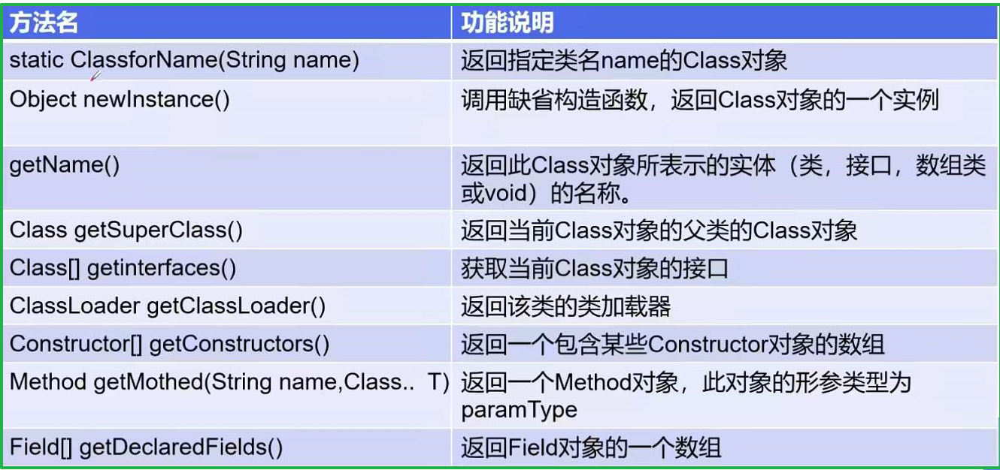
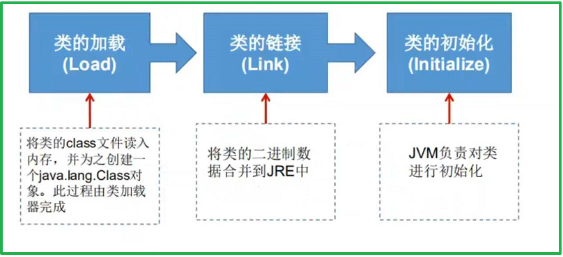

## 反射机制概述

Reflection (反射)是Java被视为动态语言的关键，反射机制允许程序在执行期借助于Reflection API取得**任何类的内部信息，并能直接操作任意对象的内部属性及方法**。
```java
Class C = Class forName(“java.lang.String”)
```
加载完类之后，在`堆内存的方法区`中就产生了一个`Class类型的对象`(一个类只有一个Class对象)，这个对象就包含了完整的类的结构信息。可以通过这个对象看到类的结构。这个对象就像一面镜子， 透过这个镜子看到类的结构，形象的称之为:反射。


## 反射机制优点

- 可以实现动态创建对象和编译，体现出很大的灵活性
## 反射机制缺点

- 对性能有影响，使用反射基本上是一种`解释操作`，可以告诉JVM,希望做什么并且它满足我们的要求。这类操作总是慢于直接执行相同的操作。

## 相关的API

- java.lang.Class ：代表一个类
- java.lang.reflect.Method ：代表类的方法
- java.reflect.Field ：代表类的成员变量
- java.lang.reflect.Constructor ：代表类的构造器
- ...
::: details Demo
```java
package com.ashe.reflection;

//什么叫反射
public class Test01 {
    public static void main(String[] args) throws ClassNotFoundException {

        //通过反射获取类的class对象
        Class aClass = Class.forName("com.ashe.reflection.User");

        System.out.println(aClass);//结果：class com.ashe.reflection.User

        System.out.println(aClass.getClass());//结果：class java.lang.Class

        //结论：一个类在内存中只有一个Class对象
        //一个类被加载后，类的整个结构都会被封装在Class对象中
        Class c2 = Class.forName("com.ashe.reflection.User");
        Class c3 = Class.forName("com.ashe.reflection.User");
        Class c4 = Class.forName("com.ashe.reflection.User");

        System.out.println("c2:" + c2.hashCode());
        System.out.println("c3:" + c3.hashCode());
        System.out.println("c3:" + c3.hashCode());
        
        /*结果：
        c2:460141958
        c3:460141958
        c3:460141958
        */

    }
}

//实体类
class User {
    private String name;
    private int id;
    private int age;

    public User() {
    }

    public User(String name, int id, int age) {
        this.name = name;
        this.id = id;
        this.age = age;
    }

    public String getName() {
        return name;
    }

    public void setName(String name) {
        this.name = name;
    }

    public int getId() {
        return id;
    }

    public void setId(int id) {
        this.id = id;
    }

    public int getAge() {
        return age;
    }

    public void setAge(int age) {
        this.age = age;
    }

    @Override
    public String toString() {
        return "User{" +
                "name='" + name + '\'' +
                ", id=" + id +
                ", age=" + age +
                '}';
    }
}
```
:::

## Class类

在Object类中定义了以下的方法，此方法将被所有子类继承。

```java
public final Class getClass()
```

以上的方法返回值的类型是一个Class类，此类是Java反射的源头，实际上所谓反射从程序的运行结果来看也很好理解，

即:可以通过对象反射求出类的名称。

对象照镜子后可以得到的信息:某个类的`属性`、`方法`和`构造器`、`某个类到底实现了哪些接口`。

对于每个类而言，JRE都为其保留一个`不变`的Class类型的对象。一个Class对象包含了特定某个结构

Class本身也是一个类：

- Class 对象只能由系统建立对象
- 一个加载的类在JVM中只会有一个Class实例
- 一个Class对象对应的是一 个加载到JVM中的一个.class文件
- 每个类的实例都会记得自己是由哪个Class实例所生成
- 通过Class可以完整地得到一个类中的所有被加载的结构
- Class类 是Reflection的根源，针对任何你想动态加载、运行的类，唯有先获得相应的Class对象

## Class类的常用方法


## 获取Class类的实例
a) 若已知具体的类,通过类的class属性获取，该方法最为安全可靠，程序性能最高。

```java
Class clazz = Person.class;
```

b) 已知某个类的实例， 调用该实例的getClass()方法获取Class对象
```java
Class clazz = person.getClass();
```
c) 已知一 个类的全类名，且该类在类路径下，可通过Class类的静态方法forName()获取,可能抛出ClassNotFoundException

d) 内置基本数据类型可以直接用类名.Type

e) 还可以利用ClassLoader

:::details Demo
```java
package com.ashe.reflection;

//测试Class类的创建方式有哪些
public class Test03 {
    public static void main(String[] args) throws ClassNotFoundException {
        Person person = new Student();
        System.out.println(person.name);

        //方式1：通过对象获得
        Class c1 = person.getClass();

        //方式2：通过forname获得
        Class c2 = Class.forName("com.ashe.reflection.Student");

        //方式3：通过类名.Class获得
        Class c3 = Student.class;

        //方式4：基本内置类型的包装类都有一个Type属性
        Class c4 = Integer.TYPE;

        //获得父类类型
        Class c5 = c1.getSuperclass();

        System.out.println(c1.hashCode());
        System.out.println(c2.hashCode());
        System.out.println(c3.hashCode());
        System.out.println(c4);
        System.out.println(c5);

    }
}

class Person{
    public String name;

    public Person() {
    }

    public Person(String name) {
        this.name = name;
    }

    @Override
    public String toString() {
        return "Person{" +
                "name='" + name + '\'' +
                '}';
    }
}

class Student extends Person{
    public Student(){
        this.name = "学生";
    }
}

class Teacher extends Person{
    public Teacher(){
        this.name = "老师";
    }
}
```
:::

## 有Class对象的类型
- class：外部类，成员（成员内部类，静态内部类），局部内部类，匿名内部类
- interface：接口
- []：数组
- enum：枚举
- annotation：注解@interface
- primitive type：基本数据类型
- void

:::details Demo
```java
package com.ashe.reflection;

import java.lang.annotation.ElementType;

//所有类型的Class
public class Test04 {
    public static void main(String[] args) {
        Class c1 = Object.class; //类
        Class c2 = Comparable.class; //接口
        Class c3 = String[].class; //一维数组
        Class c4 = int[][].class; // 二维数组
        Class c5 = Override.class; // 注解
        Class c6 = ElementType.class; // 枚举
        Class c7 = Integer.class; // 基本数据类型
        Class c8 = void.class; // Void类型
        Class c9 = Class.class; // Class

        System.out.println(c1);
        System.out.println(c2);
        System.out.println(c3);
        System.out.println(c4);
        System.out.println(c5);
        System.out.println(c6);
        System.out.println(c7);
        System.out.println(c8);
        System.out.println(c9);

        //只要元素类型和维度一样，就是同一个Class
        int[] a = new int[10];
        int[] b = new int[100];
        System.out.println(a.getClass().hashCode());//460141958
        System.out.println(b.getClass().hashCode());//460141958
    }
}
```
:::
## 类的加载过程

当程序主动使用某个类时，如果该类还未被加载到内存中，则系统会通过如下三个步骤来对该类进行初始化。



## 类加载与ClassLoader的理解

- 加载: 将`class`文件字节码内容加载到内存中，并将这些静态数据转换成方法区的运行时数据结构,然后生成一个代表这个类的`java.lang.Class`对象.
  
- 链接: 将Java类的二进制代码合并到JVM的运行状态之中的过程。
  - 验证:确保加载的类信息符合`JVM规范`，没有安全方面的问题

  - 准备: 正式为类变量`(static)`分配内存并设置类变量默认初始值的阶段，这些内存都将在方法区中进行分配

  - 解析:虚拟机常量池内的符号引用(常量名)替换为直接引用(地址)的过程
- 初始化:
  
  - 执行类构造器`<clinit>()`方法的过程，类构造器`<clinit>` ()方法是由编译期自动收集类中所有类变量的赋值动作和静态代码块中的语句合并产生的。(类构造器是构造类信息的，不是构造该类对象的构造器)。
  - 当初始化一个类的时候，如果发现其父类还没有进行初始化，则需要先触发其父类的初始化。
  - 虚拟机会保证一个类的`<clinit>()`方法在多线程环境中被正确加锁和同步。

## 类初始化的时机

- 类的主动引用(一定会发生类的初始化)

  - 当虚拟机`启动`，先初始化`main方法所在`的类
  - `new`一个类的对象
  - 调用类的静态成员(除了final常量)和静态方法
  - 使用`java.lang.reflect包`的方法对类进行反射调用
  - 当初始化一个类，如果其父类没有被初始化，则先会初始化它的父类

- 类的被动引用(不会发生类的初始化)

  - 当访问一个静态域时，只有真正声明这个域的类才会被初始化。如: 通过子类引用父类的静态变量，不会导致子类初始化

  - 通过数组定义类引用，不会触发此类的初始化

  - 引用常量不会触发此类的初始化(常量在链接阶段就存入调用类的常量池中了)

:::details
```java
package com.ashe.reflection;

//测试类什么时候会初始化
public class Test05 {
    static {
        System.out.println("main 类被加载");
    }

    public static void main(String[] args) throws ClassNotFoundException {
        
        //1、主动引用
        //Son son = new Son();

        //2、通过反射产生主动引用
        Class.forName("com.ashe.reflection.Son");
    }

}

class Father {

    static int b = 2;

    static {
        System.out.println("父类被初始化");
    }
}

class Son extends Father {
    static {
        System.out.println("子类被加载");
        m = 300;
    }

    static int m = 100;
    static final int M = 1;
}


/*
main 类被加载
父类被初始化
子类被加载
*/
```
:::

## 类加载器的作用
- 类加载的作用：将`class文件字节码`内容加载到`内存`中，并将这些静态数据转换成方法区的运行时数据结构，然后在堆中生成一个代表这个类的`java.lang.Class对象`， 作为方法区中类数据的访问入口。
- 类缓存:标准的JavaSE类加载器可以`按要求查找类`，但一旦某个类被加载到类加载器中，它将维
持加载(缓存) 一段时间。不过JVM垃圾回收机制可以回收这些Class对象


- 类加载器作用是用来把类(class)装载进内存的，JVM规范定义了如下类型的类的加载器。

## 类加载器

:::details Demo
```java
package com.ashe.reflection;

@SuppressWarnings("all")
public class Test07 {
    public static void main(String[] args) throws ClassNotFoundException {
        //获取系统类加载器
        ClassLoader systemClassLoader = ClassLoader.getSystemClassLoader();
        System.out.println(systemClassLoader);

        //获取系统类加载器的父类加载器-->拓展类加载器
        ClassLoader parent = systemClassLoader.getParent();
        System.out.println(parent);

        //获取拓展类加载器的父类-->根加载器（C/C++）
        ClassLoader parent1 = parent.getParent();
        System.out.println(parent1);

        //获取当前类是哪个加载器加载的
        ClassLoader classLoader = Class.forName("com.ashe.reflection.Test07").getClassLoader();
        System.out.println(classLoader);

        //测试JDK内置的类是谁加载的
        ClassLoader classLoader1 = Class.forName("java.lang.Object").getClassLoader();
        System.out.println(classLoader1);

        //获取系统类加载器可以加载的路径
        String property = System.getProperty("java.class.path");
        System.out.println(property);

        /*
        C:\Users\forev\.jdks\corretto-1.8.0_312\jre\lib\charsets.jar;
        C:\Users\forev\.jdks\corretto-1.8.0_312\jre\lib\ext\access-bridge-64.jar;
        C:\Users\forev\.jdks\corretto-1.8.0_312\jre\lib\ext\cldrdata.jar;
        C:\Users\forev\.jdks\corretto-1.8.0_312\jre\lib\ext\dnsns.jar;
        C:\Users\forev\.jdks\corretto-1.8.0_312\jre\lib\ext\jaccess.jar;
        C:\Users\forev\.jdks\corretto-1.8.0_312\jre\lib\ext\jfxrt.jar;
        C:\Users\forev\.jdks\corretto-1.8.0_312\jre\lib\ext\localedata.jar;
        C:\Users\forev\.jdks\corretto-1.8.0_312\jre\lib\ext\nashorn.jar;
        C:\Users\forev\.jdks\corretto-1.8.0_312\jre\lib\ext\sunec.jar;
        C:\Users\forev\.jdks\corretto-1.8.0_312\jre\lib\ext\sunjce_provider.jar;
        C:\Users\forev\.jdks\corretto-1.8.0_312\jre\lib\ext\sunmscapi.jar;
        C:\Users\forev\.jdks\corretto-1.8.0_312\jre\lib\ext\sunpkcs11.jar;
        C:\Users\forev\.jdks\corretto-1.8.0_312\jre\lib\ext\zipfs.jar;
        C:\Users\forev\.jdks\corretto-1.8.0_312\jre\lib\jce.jar;
        C:\Users\forev\.jdks\corretto-1.8.0_312\jre\lib\jfr.jar;
        C:\Users\forev\.jdks\corretto-1.8.0_312\jre\lib\jfxswt.jar;
        C:\Users\forev\.jdks\corretto-1.8.0_312\jre\lib\jsse.jar;
        C:\Users\forev\.jdks\corretto-1.8.0_312\jre\lib\management-agent.jar;
        C:\Users\forev\.jdks\corretto-1.8.0_312\jre\lib\resources.jar;
        C:\Users\forev\.jdks\corretto-1.8.0_312\jre\lib\rt.jar;
        C:\Users\forev\Desktop\Study-Code\AOE\out\production\AOE;
        C:\Program Files\JetBrains\IntelliJ IDEA 2021.2.3\lib\idea_rt.jar
        */
    }
}
```
:::

## 获取运行时类的完整结构
通过反射获取运行时类的完整结构：

Field、Method、Constructor、Superclass、Interface、Annotation

- 实现的全部接口
- 所继承的父类
- 全部的构造器
- 全部的方法
- 全部的Field
- 注解
- ...

:::details Demo
```java
package com.ashe.reflection;

import java.lang.reflect.Constructor;
import java.lang.reflect.Field;
import java.lang.reflect.Method;

//获得类的信息
public class Test08 {
    public static void main(String[] args) throws ClassNotFoundException, NoSuchFieldException, NoSuchMethodException {
        Class c1 = Class.forName("com.ashe.reflection.User");

        //获得类的名字
        String name = c1.getName();
        System.out.println(name); //获得包名+类名
        System.out.println(c1.getSimpleName());// 获得类名
        System.out.println("===========");

        //获得类的属性
        Field[] fields = c1.getFields();
        fields = c1.getDeclaredFields();
        for (Field field : fields){
            System.out.println(field);
        }
        System.out.println("===========");
        /*
        private java.lang.String com.ashe.reflection.User.name
        private int com.ashe.reflection.User.age
        private int com.ashe.reflection.User.id
         */

        //获得指定属性的值
        Field names = c1.getDeclaredField("name");
        System.out.println(names);
        System.out.println("===========");
        //获得类的方法
        Method[] methods = c1.getMethods();//获取本类和父类的全部public方法
        for (Method method : methods){
            System.out.println(method);
        }
        System.out.println("===========");
        Method[] declaredMethods = c1.getDeclaredMethods();//获取本来的全部方法
        for (Method method : declaredMethods){
            System.out.println(method);
        }
        System.out.println("===========");
        //获得指定方法
        Method getName = c1.getMethod("getName", null);
        Method setName = c1.getMethod("setName", String.class);
        System.out.println(getName);
        System.out.println(setName);

        //获得指定构造器
        System.out.println("===========");
        Constructor[] constructors = c1.getConstructors();
        for(Constructor constructor : constructors){
            System.out.println(constructor);
        }
        System.out.println("===========");
        Constructor constructor = c1.getConstructor();
        System.out.println(constructor);
        System.out.println("===========");

        //获得指定的构造器
        Constructor declaredConstructor = c1.getDeclaredConstructor(String.class, int.class, int.class);
        System.out.println(declaredConstructor);
    }
}
```
:::

## 创建运行时类的对象

创建类的对象:调用Class对象的newInstance()方法

- 类必须有一个无参数的构造器
- 类的构造器的访问权限需要足够
思考?难道没有无参的构造器就不能创建对象了吗?

- 只要在操作的时候明确的调用类中的构造器,并将参数传递进去之后，才可以实例化操作

步骤如下:

- 通过Class类的getDeclaredConstructor(Class ... parameterTypes)取得本类的指定形参类型的构造器

- 向构造器的形参中传递一个对象数组进去， 里面包含了构造器中所需的各个参数。

- 通过Constructor实例化对象

- 调用指定的方法

  - 通过反射，调用类中的方法，通过Method类完成。
  - 通过Class类的`getMethod(String name,Clas..parameterTypes)`方法取得一个Method对象，并设置此方法操作时所需要的参数类型。
  - 之后使用`Object invoke(Object obj, Object[] args)`进行调用，并向方法中传递要设置的obj对象的参数信息。
  


- Object invoke(Object obj, Object ... args)

  - Object 对应原方法的返回值,若原方法无返回值，此时返回null)
  - 若原方法若为静态方法，此时形参9bject gbj可为null
  - 若原方法形参列表为空，则Object[] args为null
  - 若原方法声明为`private`，则需要在调用此invoke()方法前，显式调用方法对象的setAccessible(true)方法，将可访问private的方法。

- setAccessible().

  - Method和Field、Constructor对象都有 setAccessible()方法
  - setAccessible作用是启动和禁用访问安全检查的开关
  - 参数值为true则指示反射的对象在使用时应该取消Java语言访问检查
  - 提高反射的效率。如果代码中必须用反射，而该句代码需要频繁的被调用，那么请设置为true
  - 使得原本无法访问的私有成员也可以访问
  - 参数值为false则指示反射的对象应该实施Java语言访问检查

::: details Demo
```java
package com.ashe.reflection;

import java.lang.reflect.Constructor;
import java.lang.reflect.Field;
import java.lang.reflect.InvocationTargetException;
import java.lang.reflect.Method;

public class Test08 {
    public static void main(String[] args) throws ClassNotFoundException, IllegalAccessException, InstantiationException, NoSuchMethodException, InvocationTargetException, NoSuchFieldException, InvocationTargetException {
        //获得Class对象
        Class c1 = Class.forName("com.ashe.reflection.User");

        //1、创建对象：
        //1.1 通过newInstance（）构造一个对象
        User user1 = (User) c1.newInstance();//实质上是调用的无参构造
        System.out.println(user1);//User{name='null', id=0, age=0}

        //1.2 通过构造器创建
        Constructor constructor = c1.getDeclaredConstructor(String.class, int.class, int.class);
        User user2 = (User) constructor.newInstance("ashe", 001, 18);
        System.out.println(user2);//User{name='ashe', id=1, age=18}

        //2、通过反射调用普通方法
        System.out.println("=============================================");
        //创建一个对象
        User user3 = (User) c1.newInstance();
        //通过反射获取一个方法
        Method setName = c1.getDeclaredMethod("setName", String.class);
        //invoke：激活 、唤醒
        //参数（对象，"方法的值"）
        setName.invoke(user3, "China");
        System.out.println(user3.getName());//China

        //3、通过反射操作属性
        System.out.println("=============================================");
        User user4 = (User) c1.newInstance();
        Field name = c1.getDeclaredField("name");

        //不能直接操作私有属性，我们需要关闭程序的安全监测，通过：name.setAccessible(true);
        name.setAccessible(true);
        name.set(user4, "ashe");
        System.out.println(user4.getName());//ashe
    }
}
```
:::

::: details 性能测试
``` java
package com.ashe.reflection;

import java.lang.reflect.InvocationTargetException;
import java.lang.reflect.Method;

public class Test09 {
    public static void main(String[] args) throws NoSuchMethodException, IllegalAccessException, InvocationTargetException {
        test01();
        test02();
        test03();
    }

    //普通方法调用
    public static void test01() {
        User user = new User();
        long start_time = System.currentTimeMillis();
        for (int i = 0; i < 1000000000; i++) {
            user.getName();
        }
        long end_time = System.currentTimeMillis();
        System.out.println("普通方式执行10亿次需要：" + (end_time - start_time) + "ms");
    }

    //反射方式调用
    public static void test02() throws NoSuchMethodException, InvocationTargetException, IllegalAccessException {
        User user = new User();
        Class c1 = user.getClass();
        Method getName = c1.getMethod("getName", null);
        getName.invoke(user, null);
        long start_time = System.currentTimeMillis();
        for (int i = 0; i < 1000000000; i++) {
            user.getName();
        }
        long end_time = System.currentTimeMillis();
        System.out.println("反射方式调用执行10亿次需要：" + (end_time - start_time) + "ms");
    }


    //反射方式调用，关闭安全监测
    public static void test03() throws NoSuchMethodException, IllegalAccessException, InvocationTargetException {
        User user = new User();
        Class c1 = user.getClass();
        Method getName = c1.getMethod("getName", null);
        getName.setAccessible(true);
        getName.invoke(user, null);
        long start_time = System.currentTimeMillis();
        for (int i = 0; i < 1000000000; i++) {
            user.getName();
        }
        long end_time = System.currentTimeMillis();
        System.out.println("反射方式调用，关闭安全监测调用执行10亿次需要：" + (end_time - start_time) + "ms");
    }

    /*
     *普通方式执行10亿次需要：7ms
     *反射方式调用执行10亿次需要：6ms
     *反射方式调用，关闭安全监测调用执行10亿次需要：7ms
     */
}
```
:::

## 获取泛型信息

- Java采用泛型擦除的机制来引入泛型，Java中的泛型仅仅是给编译器javac使用的，确保数据的安全性和免去强制类型转换问题，但是，一旦编译完成，所有和泛型有关的类型全部擦除

- 为了通过反射操作这些类型， Java新增了`ParameterizedType`, `GenericArrayType`,`TypeVariable和WildcardType`几种类型来代表不能被归一到Class类中的类型但是又和原始类型齐名的类型

- ParameterizedType：表示一种参数化类型,比如Collection

- GenericArrayType：表示一种元素类型是参数化类型或者类型变量的数组类型

- TypeVariable：是各种类型变量的公共父接口

- WildcardType：代表一种通配符类型表达式

:::details Demo
```java
package com.ashe.reflection;

import java.lang.reflect.Method;
import java.lang.reflect.ParameterizedType;
import java.lang.reflect.Type;
import java.util.List;
import java.util.Map;

//通过反射获取泛型信息
public class Test10 {

    public void test01(Map<String, User> map, List<User> list) {
        System.out.println("test01");
    }

    public Map<String, User> test02() {
        System.out.println("test02");
        return null;
    }

    public static void main(String[] args) throws NoSuchMethodException {
        Method method = Test10.class.getMethod("test01", Map.class, List.class);

        //getGenericParameterTypes():获得泛型的参数类型
        Type[] genericParameterTypes = method.getGenericParameterTypes();

        for (Type genericParameterType : genericParameterTypes) {
            System.out.println(genericParameterType);//Java.JavaBase.Collections.HashMapTest.Map<java.lang.String, kuangshen.reflection.User>
            // 判断genericParameterType是否等于ParameterizedType（结构化参数类型）
            if (genericParameterType instanceof ParameterizedType) {
                //getActualTypeArguments()：获得真实的参数信息
                Type[] actualTypeArguments = ((ParameterizedType) genericParameterType).getActualTypeArguments();
                for (Type actualTypeArgument : actualTypeArguments) {
                    System.out.println(actualTypeArgument);
                }
            }
        }

        System.out.println("===============test02====================");
        method = Test10.class.getMethod("test02", null);
        Type genericReturnType = method.getGenericReturnType();
        if (genericReturnType instanceof ParameterizedType) {
            //getActualTypeArguments()：获得真实的参数信息
            Type[] actualTypeArguments = ((ParameterizedType) genericReturnType).getActualTypeArguments();
            for (Type actualTypeArgument : actualTypeArguments) {
                System.out.println(actualTypeArgument);
            }
        }
    }
}

/*
 * java.util.Map<java.lang.String, com.ashe.reflection.User>
 * class java.lang.String
 * class com.ashe.reflection.User
 * java.util.List<com.ashe.reflection.User>
 * class com.ashe.reflection.User
 * ===============test02====================
 * class java.lang.String
 * class com.ashe.reflection.User
 */
```
:::

## 获取注解信息

- getAnnotations()
- getAnnotation()

:::details Demo
```java
package com.ashe.reflection;

import java.lang.annotation.*;
import java.lang.reflect.Field;

//练习反射操作注解
public class Test11 {

    public static void main(String[] args) throws ClassNotFoundException, NoSuchFieldException {

        Class c1 = Class.forName("com.ashe.reflection.Student2");

        //通过反射获取注解
        Annotation[] annotations = c1.getAnnotations();
        for (Annotation annotation : annotations) {
            System.out.println(annotation);//
        }

        //获得注解value的值
        TestAnno testAnno = (TestAnno) c1.getAnnotation(TestAnno.class);
        System.out.println(testAnno.value());//db_student

        System.out.println("================================");
        //获得类指定的注解
        Field f = c1.getDeclaredField("name");
        FieldAnno annotation = f.getAnnotation(FieldAnno.class);
        System.out.println(annotation.columnName());//db_name
        System.out.println(annotation.type());//varchar
        System.out.println(annotation.length());//10
    }
}

@TestAnno("db_student")
class Student2 {
    @FieldAnno(columnName = "db_id", type = "int", length = 10)
    private int id;
    @FieldAnno(columnName = "db_name", type = "varchar", length = 10)
    private String name;
    @FieldAnno(columnName = "db_age", type = "int", length = 10)
    private int age;

    public Student2() {
    }

    public Student2(int id, String name, int age) {
        this.id = id;
        this.name = name;
        this.age = age;
    }

    public int getId() {
        return id;
    }

    public void setId(int id) {
        this.id = id;
    }

    public String getName() {
        return name;
    }

    public void setName(String name) {
        this.name = name;
    }

    public int getAge() {
        return age;
    }

    public void setAge(int age) {
        this.age = age;
    }

    @Override
    public String toString() {
        return "Student2{" +
                "id=" + id +
                ", name='" + name + '\'' +
                ", age=" + age +
                '}';
    }
}

//创建一个注解
@Target(ElementType.TYPE)//类上使用
@Retention(RetentionPolicy.RUNTIME)
        //Retention：表示我们的注解在什么地方有效
@interface TestAnno {
    String value();

}

//属性的注解
@Target(ElementType.FIELD)//类上使用
@Retention(RetentionPolicy.RUNTIME)
@interface FieldAnno {
    String columnName();

    String type();

    int length();
}
```
:::