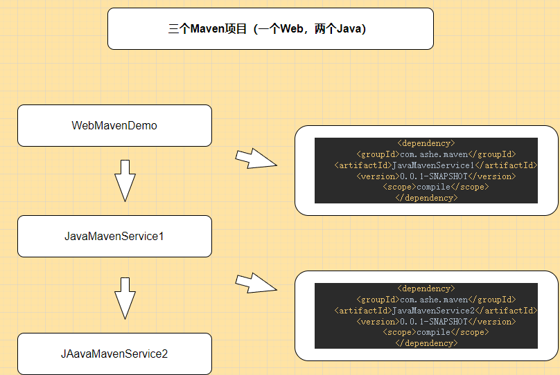

## 依赖的传递性



WebMavenDemo项目依赖`JavaMavenService1` 

`JavaMavenService1`项目依赖`JavaMavenService2`

pom.xml文件配置好依赖关系后，必须首先mvn install后，依赖的jar包才能使用。

WebMavenDemo的pom.xml文件想能编译通过，`JavaMavenService1`必须`mvn install`

`JavaMavenService1`的`pom.xml`文件想能编译通过，`JavaMavenService2`必须`mvn install`

## 传递性


在Eclipse / IntelliJ IDEA中，为JavaMavenService2中增加了一个spring-core.jar包后，会惊喜的发现依赖的两个项目都自动的增加了这个jar包，这就是依赖的传递性
::: danger 注意
```java
非compile范围的依赖是不能传递的
```
:::
