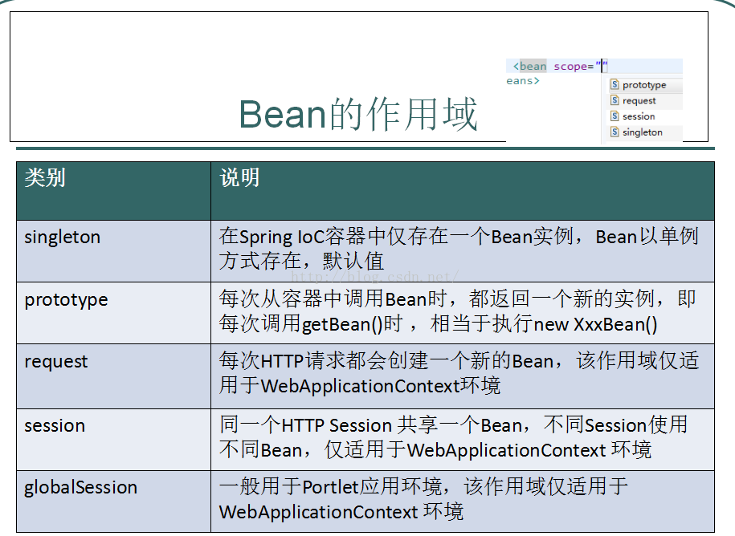

## Bean的作用域

在Spring中，那些组成应用程序的主体及由Spring IoC容器所管理的对象，被称之为bean。
> 简单地讲，bean就是由IoC容器初始化、装配及管理的对象 .



几种作用域中，`request`、`session`作用域仅在基于`web的应用中使用`（不必关心你所采用的是什么web应用框架）
> 只能用在基于web的Spring ApplicationContext环境。

## Singleton
当一个bean的作用域为`Singleton`，那么Spring IoC容器中只会存在一个共享的bean实例，并且所有对bean的请求，只要id与该bean定义相匹配，则只会返回bean的同一实例。

> Singleton是单例类型，就是在创建起容器时就同时自动创建了一个bean的对象，不管你是否使用，他都存在了，每次获取到的对象都是同一个对象。注意，Singleton作用域是Spring中的缺省作用域。要在XML中将bean定义成singleton，可以这样配置：
```xml
<bean id="user" class="com.ashe.pojo.User" c:name="asheone" c:age="18" scope="singleton" />
```

## Prototype
当一个bean的作用域为`Prototype`，表示一个bean定义对应`多个对象实例`。Prototype作用域的bean会导致在每次对该bean请求（将其注入到另一个bean中，或者以程序的方式调用容器的getBean()方法）时都会创建一个新的bean实例。

> Prototype是原型类型，它在我们创建容器的时候并没有实例化，而是当我们获取bean的时候才会去创建一个对象，而且我们每次获取到的对象都不是同一个对象。根据经验，对有状态的bean应该使用prototype作用域，而对无状态的bean则应该使用singleton作用域。在XML中将bean定义成prototype，可以这样配置：

```xml
<bean id="user" class="com.ashe.pojo.User" c:name="asheone" c:age="18" scope="prototype" />
```

### Singleton!=Prototype
Singleton不等于Prototype，通过查看`HashCode`的方式测试
```java
@Test
public void test03(){
    ApplicationContext context = new ClassPathXmlApplicationContext("userbeans.xml");
    User user = context.getBean("user2", User.class);
    User user2 = context.getBean("user2",User.class);
    System.out.println(user==user2);
    System.out.println(user.hashCode());
    System.out.println(user2.hashCode());

// false
// 802581203
// 1561408618
    }
```

## Request

当一个bean的作用域为`Request`，表示在一次`HTTP请求中`，一个bean定义`对应一个实例`；即每个HTTP请求都会有各自的bean实例，它们依据某个bean定义创建而成。该作用域`仅在基于web的Spring ApplicationContext`情形下有效。考虑下面bean定义：

```xml
 <bean id="loginAction" class=cn.csdn.LoginAction" scope="request"/>
```
> 针对每次HTTP请求，Spring容器会根据loginAction bean的定义创建一个全新的LoginAction bean实例，且该loginAction bean实例仅在当前HTTP request内有效，因此可以根据需要放心的更改所建实例的内部状态，而其他请求中根据loginAction bean定义创建的实例，将不会看到这些特定于某个请求的状态变化。当处理请求结束，request作用域的bean实例将被销毁。

## Session
当一个bean的作用域为`Session`，表示在一个`HTTP Session中`，一个bean定义对应一个实例。该作用域`仅在基于web的Spring ApplicationContext情形下有效`。考虑下面bean定义：
```xml
 <bean id="userPreferences" class="com.foo.UserPreferences" scope="session"/>
```
> 针对某个HTTP Session，Spring容器会根据userPreferences bean定义创建一个全新的userPreferences bean实例，且该userPreferences bean仅在当前HTTP Session内有效。与request作用域一样，可以根据需要放心的更改所创建实例的内部状态，而别的HTTP Session中根据userPreferences创建的实例，将不会看到这些特定于某个HTTP Session的状态变化。当HTTP Session最终被废弃的时候，在该HTTP Session作用域内的bean也会被废弃掉。