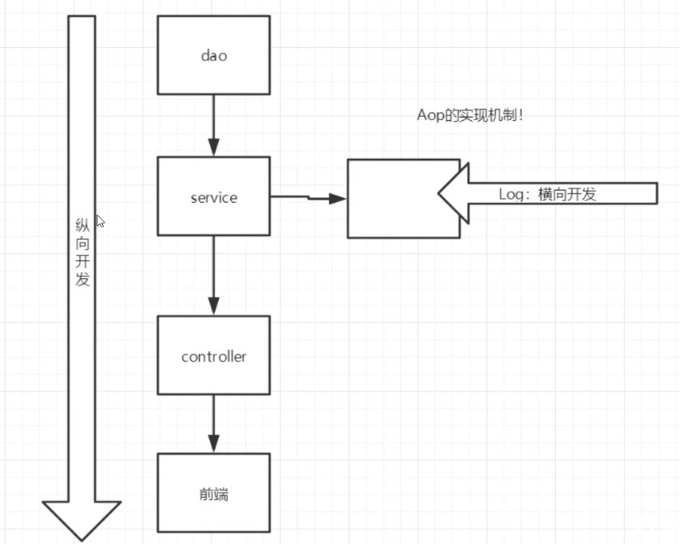

## 代理模式

AOP的底层机制就是动态代理

代理模式：

- 静态代理

- 动态代理

## 静态代理

角色分析：

- 抽象角色：一般会使用接口或者抽象类来解决
- 真实角色：被代理的角色
- 代理角色：代理真实角色，代理真实角色后，我们一般会做一些附属操作
- 客户：访问代理对象的人

### 好处与弊端

好处: 

- 可以使真实角色的操作更加纯粹！不用关注一些公共的业务
- 公共事情就交给代理角色！实现了业务的分工
- 公共业务发生扩展的时候，方便集中管理

缺点：

- 一个真实角色就会产生一个代理角色；代码量会翻倍～开发效率会变低
### 实现
1. 接口
```java
//租房接口
public interface Rent {
    public void rent();
}
```

2. 真实角色
```java
//房东
public class Host implements Rent {
    @Override
    public void rent(){
        System.out.println("房东要出租房子！🏠");
    }
}
```
3. 代理角色
```java
public class Proxy implements Rent {
    private Host host;

    public Proxy() {
    }

    public Proxy(Host host) {
        this.host = host;
    }

    @Override
    public void rent() {
        seeHouse();
        host.rent();
        hetong();
        fare();
    }
    //看房
    public void seeHouse(){
        System.out.println("中介带你看房");
    }

    //签署合同
    public void hetong(){
        System.out.println("签租赁合同");
    }

    //收取中介费
    public void fare(){
        System.out.println("收取中介费");
    }
}
```

4. 客户端访问代理角色

```java
public class Client {
    public static void main(String[] args) {
        //房东要租房子
        Host host = new Host();
        //代理，中介帮房东租房子，但是代理角色一般会有一些附属操作！
        Proxy proxy = new Proxy(host);
        //不用面对房东，直接找中介租房即可！
        proxy.rent();
    }
}
```

## 静态代理再理解
在不改变原来的代码的情况下，实现了对原有功能的增强，这是AOP中最核心的思想

### 例子
1. 创建一个抽象角色，比如CRUD
```java
//抽象角色：增删改查业务
public interface UserService {
   void add();
   void delete();
   void update();
   void query();
}
```

2. 需要一个真实对象来完成这些Crud
```java
//真实对象，完成增删改查操作的人
public class UserServiceImpl implements UserService {

   public void add() {
       System.out.println("增加了一个用户");
  }

   public void delete() {
       System.out.println("删除了一个用户");
  }

   public void update() {
       System.out.println("更新了一个用户");
  }

   public void query() {
       System.out.println("查询了一个用户");
  }
}
```

3. 需求来了，现在需要增加一个日志功能

思路1 ：在实现类上增加代码 【麻烦】

思路2：使用代理来做，能够不改变原来的业务情况下，实现此功能就是最好的了！

4. 设置一个代理类来处理日志！代理角色
```java
//代理角色，在这里面增加日志的实现
public class UserServiceProxy implements UserService {
   private UserServiceImpl userService;

   public void setUserService(UserServiceImpl userService) {
       this.userService = userService;
  }

   public void add() {
       log("add");
       userService.add();
  }

   public void delete() {
       log("delete");
       userService.delete();
  }

   public void update() {
       log("update");
       userService.update();
  }

   public void query() {
       log("query");
       userService.query();
  }

   public void log(String msg){
       System.out.println("执行了"+msg+"方法");
  }

}
```
5. 测试访问类
```java
public class Client {
   public static void main(String[] args) {
       //真实业务
       UserServiceImpl userService = new UserServiceImpl();
       //代理类
       UserServiceProxy proxy = new UserServiceProxy();
       //使用代理类实现日志功能！
       proxy.setUserService(userService);

       proxy.add();
  }
}
```

## 聊聊AOP


## 动态代理

动态代理
动态代理的角色和静态代理的一样 .

动态代理的代理类是`动态生成`的 . 静态代理的代理类是`提前写好`的

动态代理分为两类 : 一类是基于`接口`动态代理 , 一类是基于`类`的动态代理

基于接口的动态代理----JDK动态代理

基于类的动态代理--cglib

现在用的比较多的是 `javasist` 来生成动态代理

这里使用JDK的原生代码来实现，其余的道理都是一样的

JDK的动态代理需要了解两个类

核心 : `InvocationHandler`和`Proxy` 

### InvocationHandler

InvocationHandler: 是由代理实例的调用处理程序实现的接口，每个代理都有一个关联的调用处理程序。

```java
Object invoke(Object proxy, 方法 method, Object[] args)；
```

- proxy: 调用该方法的代理实例
- method: 所述方法对应于调用代理实例上的接口方法的实例。方法对象的声明类将是该方法声明的接口，它可以是代理类继承该方法的代理接口的超级接口
- args: 包含的方法调用传递代理实例的参数值的对象的阵列，或null如果接口方法没有参数。原始类型的参数包含在适当的原始包装器类的实例中，例如`java.lang.Integer`或`java.lang.Boolean` 

### Proxy  
Proxy: 提供了创建动态代理类和实例的静态方法，它也是由这些方法创建的所有动态代理类的超类
```java
//生成代理类
public Object getProxy(){
   return Proxy.newProxyInstance(this.getClass().getClassLoader(),
                                 rent.getClass().getInterfaces(),
                                 this);
}
```

## 实现

1. 抽象角色
```java
//抽象角色：租房
public interface Rent {
   public void rent();
}
```

2. 真实角色
```java
//真实角色: 房东，房东要出租房子
public class Host implements Rent{
   public void rent() {
       System.out.println("房屋出租");
  }
} 
```

3. 代理角色
```java
public class ProxyInvocationHandler implements InvocationHandler {
   private Rent rent;

   public void setRent(Rent rent) {
       this.rent = rent;
  }

   //生成代理类，重点是第二个参数，获取要代理的抽象角色！之前都是一个角色，现在可以代理一类角色
   public Object getProxy(){
       return Proxy.newProxyInstance(this.getClass().getClassLoader(),
               rent.getClass().getInterfaces(),this);
  }

   // proxy : 代理类 method : 代理类的调用处理程序的方法对象.
   // 处理代理实例上的方法调用并返回结果
   @Override
   public Object invoke(Object proxy, Method method, Object[] args) throws Throwable {
       seeHouse();
       //核心：本质利用反射实现！
       Object result = method.invoke(rent, args);
       fare();
       return result;
  }

   //看房
   public void seeHouse(){
       System.out.println("带房客看房");
  }
   //收中介费
   public void fare(){
       System.out.println("收中介费");
  }

}
```

4. 测试
```java
//租客
public class Client {

   public static void main(String[] args) {
       //真实角色
       Host host = new Host();
       //代理实例的调用处理程序
       ProxyInvocationHandler pih = new ProxyInvocationHandler();
       pih.setRent(host); //将真实角色放置进去！
       Rent proxy = (Rent)pih.getProxy(); //动态生成对应的代理类！
       proxy.rent();
  }

}
```

## 理解
核心: 一个动态代理 , 一般代理某一类业务 , 一个动态代理可以代理多个类，代理的是接口

## 通用
编写一个通用的动态代理实现的类！所有的代理对象设置为Object即可
```java
public class ProxyInvocationHandler implements InvocationHandler {
   private Object target;

   public void setTarget(Object target) {
       this.target = target;
  }

   //生成代理类
   public Object getProxy(){
       return Proxy.newProxyInstance(this.getClass().getClassLoader(),
               target.getClass().getInterfaces(),this);
  }

   // proxy : 代理类
   // method : 代理类的调用处理程序的方法对象.
   public Object invoke(Object proxy, Method method, Object[] args) throws Throwable {
       log(method.getName());
       Object result = method.invoke(target, args);
       return result;
  }

   public void log(String methodName){
       System.out.println("执行了"+methodName+"方法");
  }

}
```
测试

```java
public class Test {
   public static void main(String[] args) {
       //真实对象
       UserServiceImpl userService = new UserServiceImpl();
       //代理对象的调用处理程序
       ProxyInvocationHandler pih = new ProxyInvocationHandler();
       pih.setTarget(userService); //设置要代理的对象
       UserService proxy = (UserService)pih.getProxy(); //动态生成代理类！
       proxy.delete();
  }
}
```

## 好处
静态代理有的它都有，静态代理没有的，它也有

可以使得我们的真实角色更加纯粹 . 不再去关注一些公共的事情 

公共的业务由代理来完成 . 实现了业务的分工 

公共业务发生扩展时变得更加集中和方便 

一个动态代理 , 一般代理某一类业务

一个动态代理可以代理多个类，代理的是接口